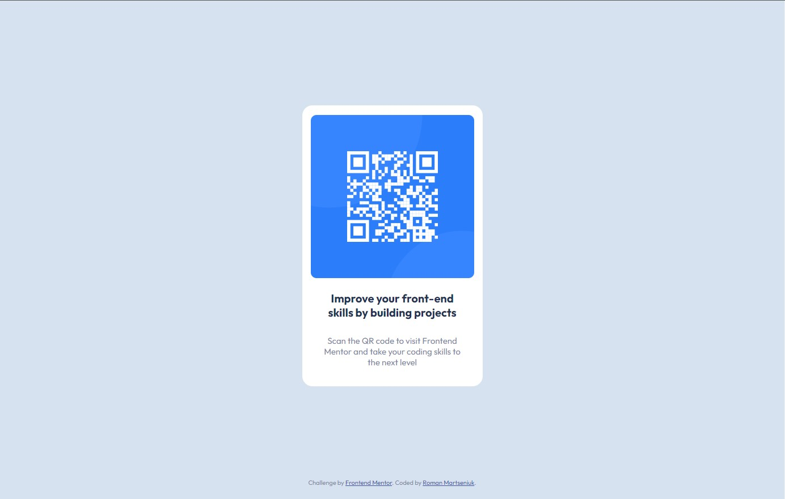

# Frontend Mentor - QR code component solution

This is a solution to the [QR code component challenge on Frontend Mentor](https://www.frontendmentor.io/challenges/qr-code-component-iux_sIO_H).

## Table of contents

- [Overview](#overview)
  - [Screenshot](#screenshot)
  - [Links](#links)
- [My process](#my-process)
  - [Built with](#built-with)
- [Author](#author)

## Overview

### Screenshot

### Links

- Solution URL: [Add solution URL here](https://github.com/RomanMartseniuk/qr-code-component-main)
- Live Site URL: [Add live site URL here](https://romanmartseniuk.github.io/qr-code-component-main/)

## My process

### Built with

- Semantic HTML5 markup
- CSS custom properties approximating the example
- SCSS
- Flexbox
- Mobile-first workflow

## Author

- Website - [Roman Martseniuk](https://github.com/RomanMartseniuk)
- Frontend Mentor - [@RomanMartseniuk](https://www.frontendmentor.io/profile/RomanMartseniuk)

